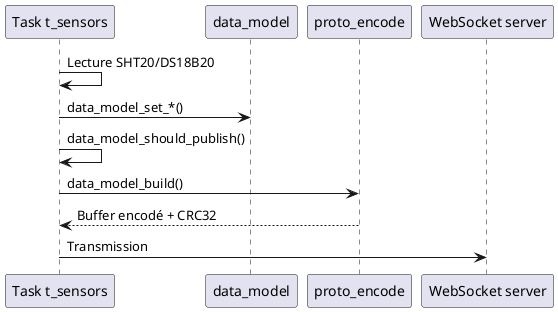

# Schémas de câblage et compatibilité matérielle

## 1. Topologie générale

```
┌───────────────┐      I²C0 @400 kHz      ┌─────────────────────┐
│ ESP32-S3 MCU  │────────────────────────▶│ SHT20 #1 (0x40)     │
│ (Sensor Node) │                         ├─────────────────────┤
│               │────────────────────────▶│ SHT20 #2 (0x40)     │
│  GPIO8  ──────┼── 1-Wire w/ 4k7 pull-up └─────────────────────┘
│  GPIO17/18 ───┼── SDA/SCL ──┐
│  GPIO2  ──────┼── Status LED│          ┌─────────────────────┐
│               │             └─────────▶│ MCP23017 #0 (0x20)  │
│               │                        ├─────────────────────┤
│               │             ┌─────────▶│ MCP23017 #1 (0x21)  │
│               │             │          └─────────────────────┘
│               │             │
│               │             │          ┌─────────────────────┐
│               │             └─────────▶│ PCA9685 (0x41)      │
└───────────────┘                        └─────────────────────┘
```

### Notes critiques

- **Pull-ups I²C** : 4,7 kΩ sur SDA/SCL reliés au 3V3 du capteur. Distance max recommandée < 30 cm.
- **1-Wire** : câble torsadé blindé recommandé. Le pull-up 4,7 kΩ est placé côté carte.
- **Alimentation** : fournir 5 V / 1 A. Les capteurs fonctionnent en 3V3 via LDO embarqué.

## 2. Connectique détaillée

| Fonction            | Broche ESP32-S3 | Connecteur externe | Remarques |
|---------------------|-----------------|--------------------|-----------|
| SDA I²C0            | GPIO17          | CN1-3              | Fil blanc, torsadé avec SCL |
| SCL I²C0            | GPIO18          | CN1-4              | Fil bleu |
| 1-Wire capteurs     | GPIO8           | CN2-1              | Blindage relié à GND |
| LED statut          | GPIO2           | LED verte + 330 Ω  | Clignote à 1 Hz |
| VBUS                | 5 V             | CN3-1              | Fusible 500 mA recommandé |
| GND                 | GND             | CN3-2              | Relier au blindage châssis |

## 3. Compatibilité ESP32-S3

| Module | Ajustements nécessaires | sdkconfig additionnel |
|--------|-------------------------|-----------------------|
| ESP32-S3-WROOM-2-N8R8 | Désactiver PSRAM OPI, taille flash 8 Mo | `CONFIG_ESPTOOLPY_FLASHSIZE_8MB=y`, `CONFIG_ESPTOOLPY_FLASHMODE_QIO=y` |
| ESP32-S3-MINI-1 | Cartographie GPIO différente : déplacer 1-Wire sur GPIO4 | `CONFIG_SENSOR_ONEWIRE_GPIO=4` |
| ESP32-S3-USB-OTG | Alimentation via USB-OTG, ajuster alimentation 5 V | Vérifier `CONFIG_ESP32S3_USB_OTG_SUPPORTED=y` |

## 4. Adaptation à d'autres périphériques

### 4.1. Capteurs I²C alternatifs

- **SHT31-DIS** : remplacer `drivers/sht20.c` par une implémentation SHT31, garder l'interface `sht20_read_temperature_humidity` pour compatibilité.
- **BME280** : sélectionnez `Sensor Node Options → Ambient sensor type → Bosch BME280` pour activer le driver `drivers/bme280.c`. Les lectures compensées température/humidité/pression sont automatiquement converties et publiées dans le data model.
- Le choix `Sensor Node Options → Ambient sensor type` expose les symboles `CONFIG_SENSOR_AMBIENT_SENSOR_SHT20` / `CONFIG_SENSOR_AMBIENT_SENSOR_BME280`. Utilisez-les pour encapsuler les inclusions conditionnelles dans le code.

### 4.2. Extension GPIO

- Pour un MCP23008 (8 bits), conserver l'abstraction `data_model_set_gpio` mais ne remplir que `port_a`.
- Ajouter un adaptateur dans `io/io_map.c` pour mapper dynamiquement les adresses.

### 4.3. PWM alternatif (TLC5947)

- Créer `drivers/tlc5947.c` utilisant SPI. Sélectionner `Sensor Node Options → PWM backend → TI TLC5947 (SPI)` afin de publier `CONFIG_SENSOR_PWM_BACKEND="tlc5947"` et `CONFIG_SENSOR_PWM_BACKEND_DRIVER_TLC5947`.
- L'option `Disable external PWM backend` laisse `t_io` propager les commandes uniquement dans le data model sans toucher de contrôleur matériel ; utilisez-la pour les maquettes sans PCA9685/TLC5947.
- Adapter `data_model_set_pwm` pour accepter 24 canaux mais limiter à 16 lors de l'encodage JSON.

## 5. Diagramme de séquence acquisition → publication



## 6. Checklist hardware avant mise sous tension

1. Vérifier la continuité GND ↔ châssis (< 0,5 Ω).
2. Confirmer l'absence de court-circuit entre 3V3 et GND (> 10 kΩ à froid).
3. Tester l'isolement du bus 1-Wire (> 1 MΩ par rapport à GND).
4. Brancher les capteurs à chaud uniquement après initialisation du firmware pour éviter les pics d'inrush.
5. Logger la tension 3V3 pendant 5 minutes (oscilloscope) pour vérifier l'ondulation < 50 mVpp.

